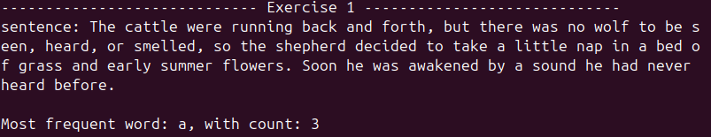
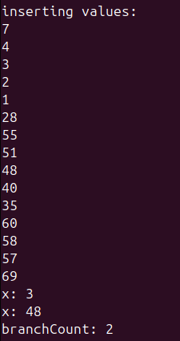
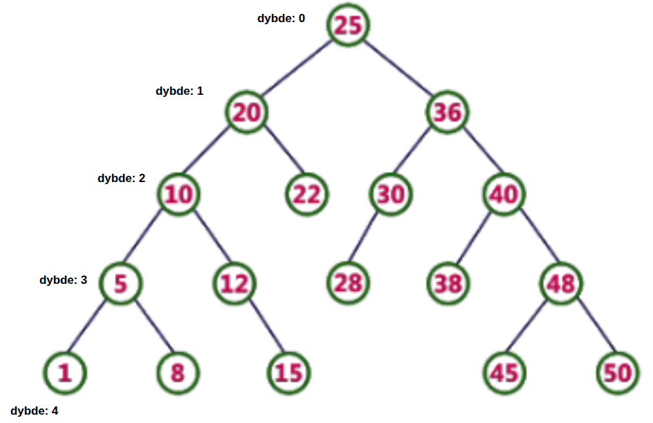

\fullrule
**Main-filen og HashMap-klassen, er kopieret ind i bunden af pdf'en, men kan også findes vedhæftet sammen med afleveringen, klar til at køre. De relevante metoder til BinarySearchTree-klassen er også kopieret ind i bunden af pdf'en**

**koden kan kompileres med: ** `g++ main.cpp BinarySearchTree.cpp hashMap.cpp -o main`

\fullrule

# **Opgave 1**  

Metoden findMostFrequentWord modtager en string af tekst som input og smider denne ind i en cpp-buffer, således at strtok-metoden kan benyttes til at fjernede specificerede "delimeters": komma, punktum og mellemrum. 
Metoden returnere det ord som er det hyppigts forekommende i sætningen. 

```cpp
/*------------------ Method for exercise 1 from P2E------------------*/
std::string findMostFrequentWord(std::string text) {
    std::vector<char> buffer(text.begin(), text.end());
    buffer.push_back('\0');  // ensure it's null-terminated
    
    int tbSize = buffer.size();
    tbSize = 211; //fixed prime
    HashMap hm(tbSize);

    //split words by these delimeters
    char del[] = " ,."; 
    char* cw = strtok(buffer.data(), del); //c-string word
    
    //create hashmap of each word
    while (cw != nullptr) {
        hm.insert(cw); 
        cw = strtok(nullptr, del); //null-terminates at delimeters
    }
    
    //find most frequent word by the largest chain in hashmap
    std::string word = hm.findMostFrequent();
    int count = hm.getCount(word);
    std::cout<< "Most frequent word: "<< word << ", with count: "<< count<<std::endl;
    
    return word; //most frequent word
}

```
 



## **Opgave 1 - HashMap kode**

For at kunne bestemme det hyppigst forekommende ord, bruger metoden "findMostFrequentWord" en hjælpe-klasse -- som implementere en hash-tabel. 

HashMap-klassen indeholder funktionerne insert , hashFunc, findMostFrequent og getCount, og den benytter "seperate chaning", dvs at alle ordene fra tekst-strengen smides ind i hashtabellens "buckets", hvert indeks i hashtabellen har således en bucket med ordet og antallet af ord som er hashet til den samme bucket -->altså antallet af samme ord. "insert" bliver kaldt fra findMostFrequentWord, til at indsætte ordene i tabellen.
```cpp
class HashMap {
    private:
    std::vector<std::list<std::pair<std::string, int>>> _buckets;
    int _tableSize;

    public:
        HashMap(int _tableSize);
        void insert(std::string word);
        int hashFunc(const std::string &word);
        std::string findMostFrequent();
        int getCount(std::string word);
};

void HashMap::insert(std::string word) {
    int idx = hashFunc(word);
    for (auto &p : _buckets[idx]) {
        if (p.first == word) { //word is in the first spot
            p.second++; //increment counter for words
            return;
        }
    }

    _buckets[idx].push_back({word, 1}); //first word appearance
   
}
```
Hash-funktionens formål er så at omdanne en string (ord) til en int (heltal), der giver indekset hvori ordet ligges ind i hash-tabellen. Kollisioner skal undgås hvor ord er forskellige, men bevares hvor de er det samme -- så vi kan finde den bucket med flest (ens) ord i. Her vælges en standard metode til at hashe strings kaldet "polynomial rolling hash". Hvert bogstav i et ord lægges til hashværdien (h), som multipliceres med 31. 31 er en non-readable ASCII-karakter, som ofte benyttes i string-hashing bla. fordi det er et primtal. Dette gøres indtil alle bogstaver i ordet er gennemløbet. For at "skalere" hash-værdien til at svare til tabellen findes modulus af "h" for hele ordet til sidst.

```cpp
int HashMap::hashFunc(const std::string& word) {
    int h = 0;
    for (char c : word) //for each character
        h = 31 * h + c;
    return abs(h) % _tableSize;
}
```
Nu kan metoden "findMostFrequent", som bliver kaldet fra "findMostFrequentWord" så gennemsøge tabellen for den bucket som har det højeste antal ord, altså den højeste "count" af "chains. Metoden returnere det ord til "findMostFrequentWord", som printer ordet, samt maxCount (via metoden getCount), og til sidst selv returnere ordet fra tekst-strengen med flest forekomster.
```cpp
std::string HashMap::findMostFrequent(){ 
    std::string word = "null";
    int maxCount = 0;
    for (const auto& bucket : _buckets)
        for (const auto& p : bucket)
            if (p.second > maxCount) {
                word = p.first;
                maxCount = p.second;
            }
    return word; 
}
```

## **Tidskompleksitet for opgave 1**
Hashing er valgt som løsning til denne opgave da den teoretisk vil være mest optimal ift tidskompleksiteten. Nedenfor er tidskompleksiteten gennemgået for hver del af "algoritmen". 

- Fyld buffer --> **O(N)**
    Hvor N er længden på tekst-strengen der gives til metoden "findMostFrequent".  

Insert kalder `hashFunc`, som behandler alle karakterne i et ord (bortset fra "delimeters").

- `hm.insert` for et ord er derfor --> **O(L) + O(1)**
    Hvor L er ordets længde, og **O(1)** er tidskompleksiteten for at sammenligne ordet med de eksisterende keys i "_buckets". 

- `hm.insert` [for alle ord]--> **O(k) = O(N)**
    Hvor k er længden på alle ord i teksten uden delimters, men med sammenligningen af keys.

- `hm.findMostFrequent` --> **O(T) <= O(N)**  
    Hvor T er en konstant (_tablesize)

**Samlet køretid: O(N)**

\fullrule

# **Opgave 2**

{ width=20%}

branchCount er retur-værdien fra metoden "branchCount" -- **det kan ses at tallet 2 returneres, da der er 2 grene der opfylder de pågældende kriterier.**

### **Opgave 2 - Kode** 
Metoden "branchCount" bruges til at tælle de grene som opfylder kriterierne som er specificeret i opgave 2. Den bruger inorder-traversal til at gennemgå træet. Derudover kalder den metoden "getSpecialBranches", som returnere de noder (X), som kan opfylde førnævnte krav, til "branchCount". Det er altså "getSpecialBranches" som håndtere det meste af logikken i algoritmen.
\clearpage

```cpp
//public wrapper
int BinarySearchTree::branchCount() const {
    return branchCount(root);   
}
//private method
int BinarySearchTree::branchCount(BinaryNode *t) const{
    if (t == nullptr){
        return 0;
	}
    
	int count = 0;

    // count if special branch
    if (getSpecialBranches(t) != nullptr)
        count++;

    //tree traversal
    count += branchCount(t->left);
    count += branchCount(t->right);

    return count;
}
```
### **Opgave 2 - Hjælpemetoder**
Metoden "getSpecialBranches" benytter også en hjælpe-metode: "getOnlyChild", som modtager en node, og returnere nodens barn, kun HVIS det gågældende barn er et enebarn. 

```cpp
BinaryNode* BinarySearchTree::getOnlyChild(BinaryNode* node) const{
    if (node == nullptr)
        return nullptr;
	
	bool leftExists  = (node->left  != nullptr);
    bool rightExists = (node->right != nullptr);
	
	//if node has both children or no children, return nullptr
	if ((leftExists && rightExists) || (!leftExists && !rightExists))
        return nullptr;

	//if node has left child, return left, else if it has right child, return right
    return leftExists ? node->left : node->right; 
}
```
"getSpecialBranches" gennemgår således checks for:

-  om en nodes barn er enebarn
-  om nodens barnebarn er et enebarn
-  om barnetbarnet er et "blad" (altså at det ikke selv har børn)

```cpp
BinaryNode* BinarySearchTree::getSpecialBranches(BinaryNode* x) const{     
	BinaryNode* a = getOnlyChild(x); //get only child of x

	if(a != nullptr){ //a is an only child of x

		BinaryNode* b = getOnlyChild(a); //b is an only child of a [and is grandchild of x]
		
		// check if b exists
		if (b == nullptr)
			return nullptr;

		// check if b is a leaf
		if (b->left == nullptr && b->right == nullptr) {
			return x;  // x meets the criteria
		} else {
			return nullptr;
		}
	}
	return nullptr; 
}
```

## **Opgave 2 - Supplerende 1**

- Træhøjde: **6**  
- Internal path length: **47**  


Træet ER et Binært Søgetræ, da alle noder i venstre deltræ har en lavere værdi end rodens, og alle noder i højre deltræ har en højere værdi en rodens. 

Træet er IKKE et AVL træ, da det er ubalanceret --> dvs at højre og venstre deltræer har forskellige højder.

Træet er IKKE et fuldt træ --> alle noder har nemlig ikke begge børn.

Træet er IKKE et komplet træ --> da alle niveauer ikke er udfyldt fra venstre til højre

Træet er IKKE et perfekt træ --> noderne har forskellige dybder og antal af børn

HVIS træet skulle være et balanceret AVL-træ, ville det gælde for dens højde at:

$$
\text{optimal højde} \approx \log_2(n) \approx 3.9068906
$$


som er den optimale højde --> da et perfekt balanceret søgetræ maksimalt har 2^(h+1)-1 noder.


## **Opgave 2 - Supplerende 2**
Med udgangspunkt i gennemgangen fra bogen ville det først og fremmest kræve en traversering af det binære søgetræ. Derudover implementeringen metoderne BuildHeap, Insert og deleteMin, for at kunne bygge og vedligeholde køen.

- Traversering: **O(N)**
    
    For at kunne repræsentere træet i et array

- BuildHeap: **O(N)**
    
    For at kunne ordne "køen" i den rigtige rækkefølge

- Insert: **O(log N)**  
    
    For at kunne lægge nye noder ind i køen (push).

- deleteMin: **O(log N)**
    
    For at kunne slette noder fra køen (pop). For en min-heap vil det være roden der er "min". 

**Den samlede tidskompleksitet ville altså være O(N)**


\fullrule
\clearpage  


# **Opgave 3**


\begin{wrapfigure}{r}{0.55\linewidth}
    \centering
    \includegraphics[width=\linewidth]{images/InternalPathLength_3.png}
    \caption{Billedet viser hvordan Internal Path Length er fundet}
\end{wrapfigure}
\FloatBarrier
**In order Traversering:**  
`1 2 3 9 11 13 17 25 57 90`

**Level order Traversering:**  
`11 2 13 1 9 57 3 25 90 17`

Internal Path Length for et Træ er defineret som summen af alle dybderne til og med bladende.
For træet i opgave 3 kan det skrives som: 0 + 1 + 1 + 2 + 2 + 3 + 4 + 3 + 3 + 2 =>

**Internal Path Length =  21**

For at et træ kan klassificeres som et AVL træ, må højderne i alle træets højre og venstre deltræer højst have en forskel på 1. 
Ved node 13 er træet højretungt, da højden på venstre side = 3, og højden på højreside = 0. Dvs at balancefaktoren = -3.
højre-node, node 57 er dog venstretungt. Derfor kan ubalancen klassificeres som en RL-ubalance.

For at træet i opgave 3 kan være et AVL træ, skal der derfor først foretages en højre-rotation på node 57. Dernæst en venstre-rotation på node 13. 

\begin{figure}[H]
\centering

\begin{minipage}{0.48\linewidth}
    \centering
    \includegraphics[width=\linewidth]{images/RL-ubalance.png}
    \caption{Ubalancen ved node 13}
\end{minipage}
\hfill
\begin{minipage}{0.48\linewidth}
    \centering
    \includegraphics[width=\linewidth]{images/rotationer.png}
    \caption{Rotationerne}
\end{minipage}

\end{figure}


\clearpage

Tilføjelsen af node 3 har ikke haft indflydelse på hvorvidt træet er ubalanceret, da denne ikke påvirker forskellen i højder på node 13's højre- og venstre-side. Træet ville derfor STADIG være ubalanceret.

Hvis man  havde undladt at slette node 13's venstre barn (node 12), ville træet også STADIG have været ubalanceret. Da højden af node 13's venstre side da ville være 1 (da node 12 er et blad), og højden af højre side stadigvæk ville være 3 --> balancefaktoren havde derfor været: 1-3 = -2. Stadigvæk en højretung ubalance ved node 13.


\fullrule

# **Opgave 4**

**Postorder Traversering:**

`1 8 5 15 12 10 22 20 28 30 38 45 50 48 40 36 25`

**Preorder Traversering:**  

`25 20 10 5 1 8 12 15 22 36 30 28 40 38 48 45 50`

Internal Path Length for et Træ er defineret som summen af alle dybderne til og med bladende. For træet i opgave 4 kan det skrives som: 0 + 1 + 1 + 2 + 2 + 2 + 2 + 3 + 3 + 3 + 3 + 3 + 4 + 4 + 4 + 4 + 4 =>

**Internal Path Length = 45**

{ width=50%}


**Træet er ikke et AVL-træ.** Det har en ubalance ved node 20, hvor venstre-siden har en højde på 3, og højre-siden har en højde på 1. Det giver en balancefaktor på: 3-1 = 2. Altså venstretung og ubalanceret. 


\fullrule
\clearpage

# **Opgave 5**
Et Minimum Spanning Tree for opgave 5 er fundet med Prim's Algoritme.
\begin{figure}[H]
\centering
\includegraphics[width=0.7\linewidth]{images/MinimumSpanningTree.png}
\caption{Endeligt Minimum Spanning Tree via Prim's Algoritme}
\end{figure}
\begin{table}[H]
\centering


\begin{tabular}{|c|c|}
\hline
\textbf{Edge} & \textbf{Weight} \\ \hline
0 -- 1  & 1 \\ \hline
5 -- 2  & 3 \\ \hline
7 -- 3  & 1 \\ \hline
0 -- 4  & 1 \\ \hline
0 -- 5  & 2 \\ \hline
7 -- 6  & 4 \\ \hline
11 -- 7 & 3 \\ \hline
5 -- 8  & 3 \\ \hline
8 -- 9  & 4 \\ \hline
9 -- 10 & 2 \\ \hline
10 -- 11 & 5 \\ \hline
\end{tabular}
\caption{Edge weights til MST}
\end{table}


**Rækkefølge:** 0 1 4 5 2 8 9 10 11 7 3 6 

Træets totalte vælgt findes ved at summere over alle vægtene i træet, hvor mængden af kanter for en MST skal svare til: 
antallet af noder, n - 1 => 12 - 1 = `11 kanter`

**Total vælgt:** 0+1+4+5+2+8+9+10+11+7+3+6 = 29 


\fullrule


# **Opgave 6**

Med Djikstra's Algoritme, findes slutkonfigruation af grafen fra øvelse 6, på 7 steps: 
\begin{tabular}{c|c|c|c}
\textbf{v} & \textbf{known} & \textbf{$d_v$} & \textbf{$p_v$} \\ \hline
A & true & 0 & 0 \\
B & true & 5 & A \\
C & true & 3 & A \\
D & true & 9 & E \\
E & true & 7 & G \\
F & true & 8 & E \\
G & true & 6 & B \\
\end{tabular}


\clearpage
# **Koden fra hashmap klasse**

\fullrule

## **hashMap.h**
```cpp
#ifndef HASHMAP_H
#define HASHMAP_H

#include <iostream>
#include <vector>
#include <array>
#include <cmath>
#include <string>
#include <algorithm>
#include <list>
#include <utility> 


class HashMap {
    private:
    std::vector<std::list<std::pair<std::string, int>>> _buckets;// key-value
    int _tableSize;
    std::vector<int> _chainSizes;

    public:
        HashMap(int _tableSize);
        void insert(std::string word);

        int hashFunc(const std::string &word);
        std::string findMostFrequent();
        int getCount(std::string word);
        
};

#endif
```

\fullrule

## **hashMap.cpp**

```cpp
#include "hashMap.h"    

HashMap::HashMap(int tableSize): _tableSize(tableSize) {
    _buckets.resize(_tableSize);
}

void HashMap::insert(std::string word) {
    int idx = hashFunc(word);
    for (auto &p : _buckets[idx]) {
        if (p.first == word) { //word is in the first spot
            p.second++; //increment counter for words
            return;
        }
    }

    _buckets[idx].push_back({word, 1}); //first word appearance
   
}
```
\clearpage
```cpp
int HashMap::hashFunc(const std::string& word) {
    int h = 0;
    
    for (char c : word) {
        h = 31 * h + c;
    }
    
    int hashVal = abs(h) % _tableSize;
     
    //std::cout<<"hashVal: "<< hashVal<<std::endl;
    return hashVal;
}

std::string HashMap::findMostFrequent(){
    std::string word = "null";
    int maxCount = 0;
    // Loop through all buckets
    for (const auto& bucket : _buckets) {
        // Loop through all pairs inside bucket
        for (const auto& p : bucket) {
            if (p.second > maxCount) {
                word = p.first;
                maxCount = p.second;
            }
        }
    }
    return word;
}

int HashMap::getCount(std::string word){
    int wordCount = 0;
    // Loop through all buckets
    for (const auto& bucket : _buckets) {
        // Loop through all pairs inside bucket
        for (const auto& p : bucket) {
            if (p.first == word) {
                wordCount = p.second;
            }
        }
    }
    return wordCount;

}

```
\clearpage
\fullrule

## **main.cpp**

```cpp
#include "BinarySearchTree.h"
#include "hashMap.h"

#include <iostream>
#include <string>
#include <stdio.h>
#include <string.h>
#include <vector>
#include <cmath>

/*------------------ Method for exercise 1 from P2E------------------*/
/*-------------------- Utilizes the HashMap Class -------------------*/
std::string findMostFrequentWord(std::string text) {
    std::vector<char> buffer(text.begin(), text.end());
    buffer.push_back('\0');  // ensure it's null-terminated
    
    int tbSize = buffer.size();
    tbSize = 211; //fixed prime
    HashMap hm(tbSize);

    //split words by these delimeters
    char del[] = " ,."; 
    char* cw = strtok(buffer.data(), del); //c-string word
    
    //create hashmap of each word
    while (cw != nullptr) {
        hm.insert(cw); 
        cw = strtok(nullptr, del); //null-terminates at delimeters
    }
    
    //find most frequent word by the largest chain in hashmap
    std::string word = hm.findMostFrequent();
    int count = hm.getCount(word);
    std::cout<< "Most frequent word: "<< word << ", with count: "<< count<<std::endl;
    
    return word; //most frequent word
}

int main(int argc, char** argv){
    std::cout<<"----------------------------- Exercise 1 ----------------------------- "<<std::endl;
    std::string text = "The cattle were running back and forth, but there was no wolf to be seen, heard, or smelled, so the shepherd decided to take a little nap in a bed of grass and early summer flowers. Soon he was awakened by a sound he had never heard before.";
    std::cout<<"sentence: "<< text<<std::endl;
    std::cout<<"\n";
    std::string word = findMostFrequentWord(text);

    std::cout<<"----------------------------- Exercise 2 ----------------------------- "<<std::endl;
    BinarySearchTree bst;

    int vals[] = {7, 4, 3, 2, 1, 28, 55, 51, 48, 40, 35, 60, 58, 57, 69};
        std::cout<<"inserting values: "<<std::endl;
    for (int v : vals){
        std::cout<<v<<std::endl;
        bst.insert(v);

    } 
    
    
    int branchCount= bst.branchCount();
    std::cout<<"branchCount: "<<branchCount<<std::endl;

    return 0; 
};
```

\clearpage
## **Metoder til BinarySearchTree.cpp**

\fullrule

```cpp
BinaryNode* BinarySearchTree::getOnlyChild(BinaryNode* node) const{
    if (node == nullptr){
		return nullptr;
	}
        
	
	bool leftExists  = (node->left  != nullptr);
    bool rightExists = (node->right != nullptr);
	
	//if node has both children or no children, return nullptr
	if ((leftExists && rightExists) || (!leftExists && !rightExists))
        return nullptr;

	//if node has left child, return left, else if it has right child, return right
    return leftExists ? node->left : node->right; 
}

//public wrapper
int BinarySearchTree::branchCount() const {
    return branchCount(root);   
}
//private method
int BinarySearchTree::branchCount(BinaryNode *t) const{
    if (t == nullptr){
        return 0;
	}
    
	int count = 0;

    // count if special branch
    if (getSpecialBranches(t) != nullptr)
        count++;

    //tree traversal
    count += branchCount(t->left);
    count += branchCount(t->right);

    return count;
}


BinaryNode* BinarySearchTree::getSpecialBranches(BinaryNode* x) const{     
	BinaryNode* a = getOnlyChild(x); //get only child

	if(a != nullptr){ //x only has one child

		BinaryNode* b = getOnlyChild(a); 
		
		// check if b exists
		if (b == nullptr)
			return nullptr;

		// check if b is a leaf
		if (b->left == nullptr && b->right == nullptr) {
			std::cout<<"x: "<<x->element<<std::endl;
			return x;  // x meets the criteria
		} else {
			return nullptr;
		}
	}
	return nullptr; 
}
```